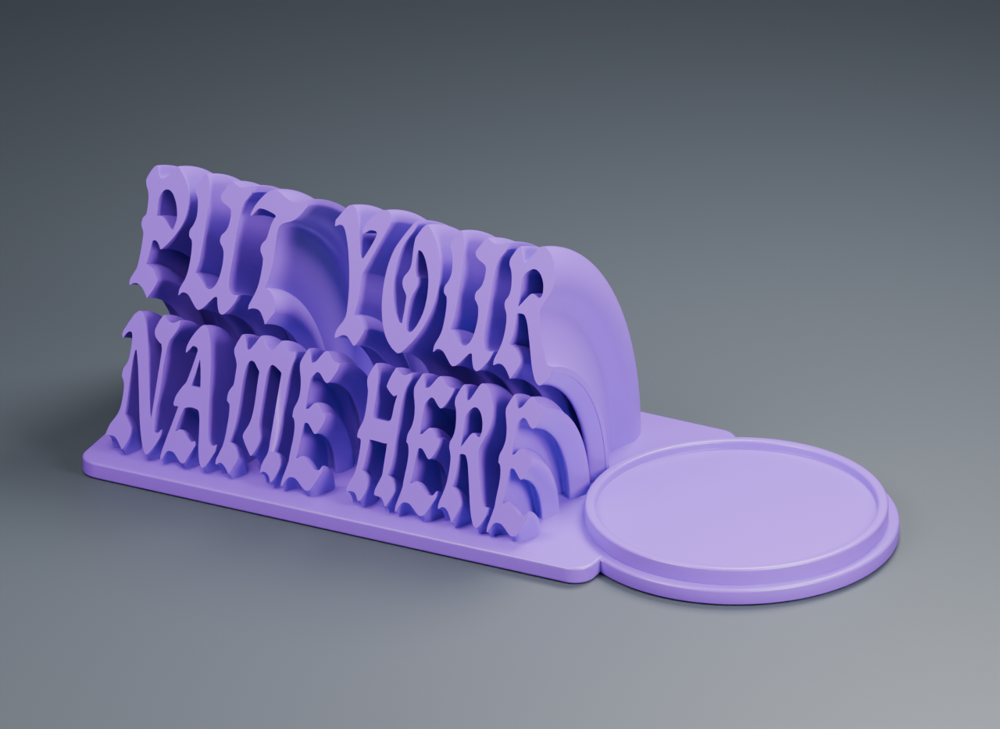

# GothicNameplate3D

**English** | [简体中文](README.zh-CN.md)

Generate a 3D nameplate from two text rows, with letters rising from the base along circular arcs and a round display platform on the right. The platform shares the nameplate's front-to-back footprint. Defaults are **150 mm** overall length and a **70°** terminal text plane measured above the horizontal base.



Export a checked STL, editable Blender scene, GLB, and preview images. The example uses **Bandosa Regular**; provide your own licensed font once, then reuse its local glyph cache.

## Quick start

Requires **Python 3.10+** and **Blender**. Modeling and export have been verified on macOS with Blender **5.2.1**; other Blender versions and operating systems have not completed full modeling validation. The generator needs no additional pip packages: Blender supplies NumPy.

```bash
git clone git@github.com:CyclopsRay/GothicNameplate3D.git
cd GothicNameplate3D

# Configure a font once; a compatible existing cache is reused
python3 generate.py setup-font /path/to/bandosa.regular.ttf

# After setup, just supply two text rows
python3 generate.py "PUT YOUR" "NAME HERE"
```

`setup-font` copies the font into the local `assets/fonts/` directory, preprocesses its supported printable glyphs, and saves it as the local default. The reference Bandosa version contains 90 printable characters. Fonts, glyph caches, and local configuration are ignored by Git; changing the text does not reconvert cached glyphs.

**Bring your own font.** Bandosa's distribution page describes personal use; this project's GPL-3.0 code license does not grant font rights. This repository does not distribute TTF/OTF files or complete derived glyph caches. Obtain a file with a license appropriate to your use from the [font distribution page](https://www.1001fonts.com/bandosa-font.html) or [Blankids Studio](https://blankidsfonts.com/product/bandosa-a-handmade-blackletter-font/). Other individual TTF/OTF fonts are also supported. See the [font guide](assets/fonts/README.md).

Blender is located using `--blender`, `BLENDER_BIN`, the system PATH, then the standard macOS installation path. If it is not found automatically, add `--blender /path/to/blender` to both the setup and generation commands. On Windows, you can use `python` instead of `python3`.

## Customize the model

```bash
python3 generate.py "MEI'S" "GARDEN" --length 180 --angle 65 --output outputs/mei-garden
python3 generate.py "ALICE" "WONDERLAND" --fit preserve --views beauty,front,side,top
python3 generate.py "YOUR" "NAME" --font /path/to/custom.ttf --no-render
```

| Argument | Default | Behavior |
| --- | --- | --- |
| Two positional arguments | Required | Top row, then bottom row; capitalization is preserved |
| `--length` | `150` | Overall length in mm; other dimensions scale proportionally |
| `--angle` | `70` | Terminal text plane angle above the base, from 45–85° |
| `--fit` | `stretch` | Fill the template; `preserve` keeps the font's proportions |
| `--font` | Local default font | TTF/OTF for this build without changing the default |
| `--output` | `outputs/<timestamp>` | New or empty directory; existing results are never overwritten |
| `--views` | `beauty,side,top` | Also accepts `front` and `back` |
| `--no-render` | Off | Generate and check the model without rendering previews |

At 150 mm overall length, the footprint is about 150 × 65 mm and the display platform's clear interior diameter is 52 mm. A two-row model at 70° is about 56 mm tall. Each filled letter or punctuation component follows its own circular arc down to the base, then joins a single solid. Changing the length scales the platform, rim, and lettering together.

Bandosa does not cover Chinese characters, accented letters, or emoji. Missing characters produce an explicit error. Unavailable curly quotes can be mapped to supported straight quotes, with substitutions recorded in the report. The current layout does not support complex-script shaping, ligatures, or bidirectional text. See [parameters](docs/parameters.md) for details, single-row mode, and JSON input.

For application integration, pass an argument list directly with `subprocess.run([sys.executable, "generate.py", top, bottom], check=True)`. If text begins like a command-line option, add `--` before the two positional arguments. The [JSON example](examples/job.json) also accepts text as data. Do not interpolate unescaped text into a shell command.

## Outputs and checks

Each successful build produces:

- `nameplate.stl`: print mesh with coordinates in millimeters.
- `nameplate.blend`: editable construction, text sources, and studio scene, with the font packed into the file.
- `nameplate.glb`: model in meters for browsers and 3D viewers.
- `renders/*.png`: the selected preview views.
- `report.json` and `stl_check.json`: dimensions, angle, cache statistics, and mesh checks.
- `request.json` and `build.log`: build parameters and execution log.

Success requires **`PASS`** in both `report.json` and `stl_check.json`. After export, the STL is read back to check a single connected solid, closed edges, nondegenerate triangles, positive volume, bottom Z=0, requested length, and terminal text angle. GLB checks also verify the millimeter-to-meter scale. Slicing and physical printing have not been verified.

## Font caching and development

Caches are identified by the font's SHA-256, Blender major/minor version, cleanup recipe version, and curve resolution. Previously cached glyphs under the same conditions should report `converted_glyphs: 0`. A build still performs arc construction, Boolean unions, mesh validation, and optional rendering; caching only removes repeated font conversion and cleanup.

For large fonts, preprocess only the characters you need:

```bash
python3 generate.py setup-font /path/to/custom.ttf --chars "ALICEBOB0123456789"
```

Later builds add missing glyphs incrementally. The maintenance documentation records the issues encountered and their fixes:

- [Font preprocessing](docs/font-preprocessing.md): Blender spacing calibration, vertices without filled faces, and contours touching at a point.
- [Troubleshooting](docs/troubleshooting.md): Boolean failures, duplicate opposite triangles, scaling precision, and export units.
- [Validation and tests](docs/validation.md): test coverage, commands, and front, side, and top preview images.

Lightweight tests run in CI. Full Blender validation requires a local font:

```bash
python3 -m pip install numpy  # Only needed for standalone mesh tests, not generation
python3 -m unittest discover -s tests -v
python3 generate.py "PUT YOUR" "NAME HERE" --no-render
```

The code is licensed under [GNU GPL v3](LICENSE). Third-party fonts and their derived assets follow their own licenses; see [THIRD_PARTY.md](THIRD_PARTY.md).
