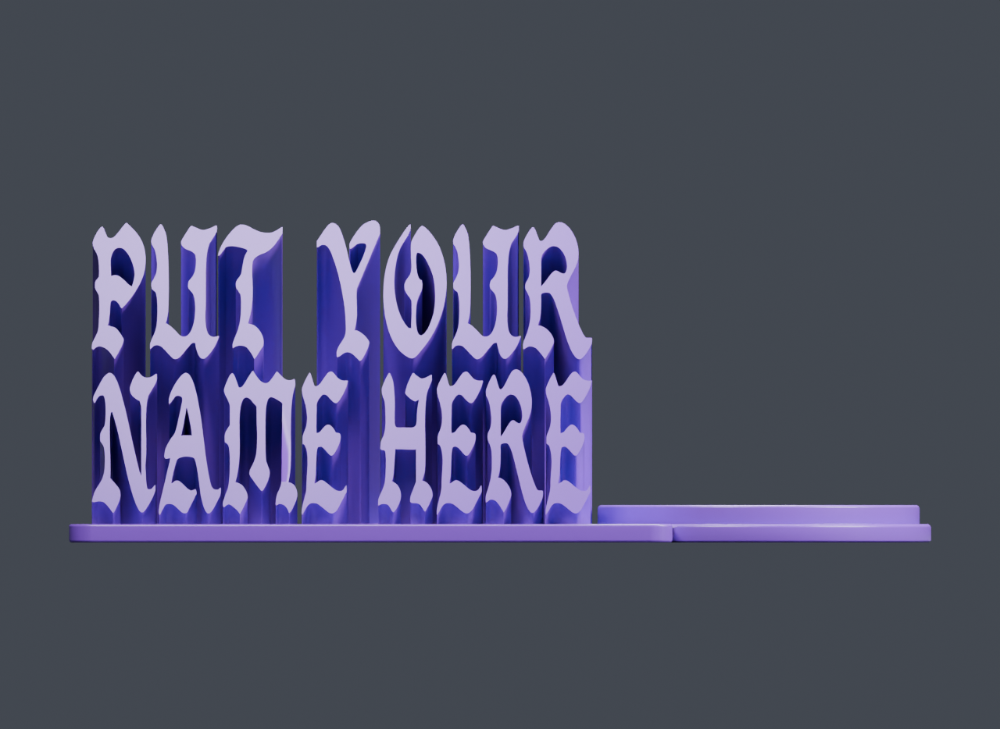
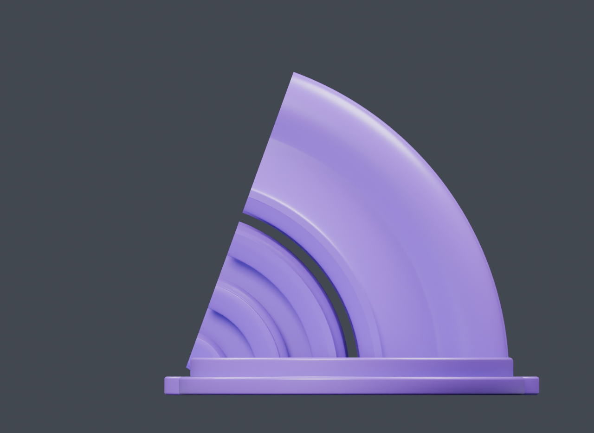
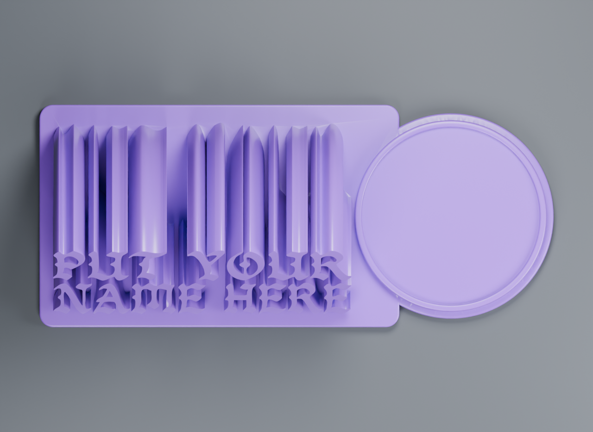

# Validation

## Lightweight suite

```bash
python3 -m pip install numpy
python3 -m unittest discover -s tests -v
```

The lightweight suite tests literal text argument forwarding, missing font guidance, unique output paths, safe default-font setup, preservation of previous results, malformed job rejection, and independently written synthetic STL/GLB files. It checks that open solids, incorrect dimensions/angles, and missing unit conversion are rejected. These tests do not need a font or Blender. GitHub Actions runs them with Python 3.10 and 3.13 on Linux.

## Actual Blender regression

```bash
NAMEPLATE_TEST_FONT=/path/to/bandosa.regular.ttf \
  python3 -m unittest discover -s tests -p test_blender_integration.py -v
```

This optional test runs Blender, exports all three model formats, and verifies that `PUT YOUR / NAME HERE` preserves the two default row heights (26 and 27 mm) with a single closed STL. It creates a temporary model directory and deletes those test artifacts afterward; glyph caches remain reusable locally. The test is skipped in public CI because the font is not distributed.

For visual verification and retained outputs:

```bash
python3 generate.py "PUT YOUR" "NAME HERE" \
  --output outputs/put-your-name-here --views beauty,front,side,top
```

Review the four previews, plus `report.json` and `stl_check.json`. A process exit code or an existing `.stl` alone is insufficient.

| Front | Side | Top |
| --- | --- | --- |
|  |  |  |

## Validation boundaries

The generator was exercised on macOS with Blender 5.2.1. The underlying workflow also tested different names, a custom rounded font, cache reuse, a 180 mm / 65° model, single-row text, quote substitution, and missing-character rejection. Those cases informed the fixes in [troubleshooting.md](troubleshooting.md).

Repository validation uses `PUT YOUR / NAME HERE` at 150 mm / 70°, including the updated row fitting behavior. Checked metrics and machine-independent results are recorded in [example-validation.json](example-validation.json). The preview images come from that run.

No slicer or physical print test is claimed. Mesh checks establish the reported topology, dimensions, and export units; they do not establish every font's suitability at every print scale, complex-script shaping, printer support requirements, or compatibility with every Blender release.
